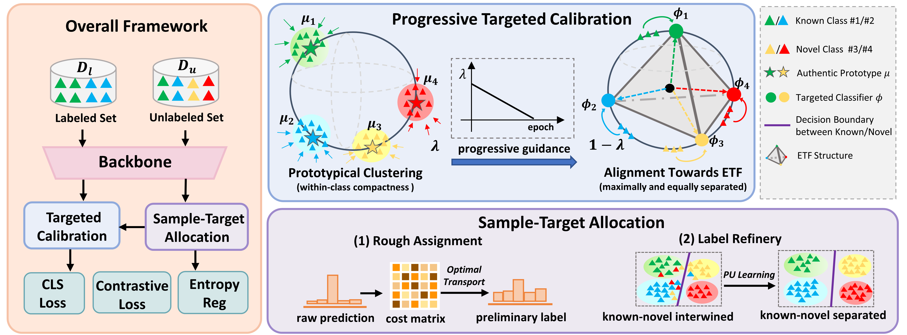

# Targeted Representation Alignment for Open-World Semi-Supervised Learning

This is the implementation of our CVPR 2024 paper [TRAILER](https://openaccess.thecvf.com/content/CVPR2024/papers/Xiao_Targeted_Representation_Alignment_for_Open-World_Semi-Supervised_Learning_CVPR_2024_paper.pdf). 

**Title:** Targeted Representation Alignment for Open-World Semi-Supervised Learning

**Authors:** Ruixuan Xiao, Lei Feng, Kai Tang, Junbo Zhao, Yixuan Li, Gang Chen, Haobo Wang

**Affliations:** Zhejiang University, Singapore University of Technology and Design, University of Wisconsin-Madison


### Overview

In this paper, we propose a novel framework TRAILER for open-world SSL. We first take inspiration from the recently discovered neural collapse phenomenon and intend to attain its appealing feature arrangement with minimal withinclass and maximum between-class covariance. To achieve this, we adopt a targeted classifier and align representations towards its pre-assigned optimal structure in a progressive manner. To further tackle the potential downsides of such stringent alignment, we encapsulate a sample-target allocation mechanism with coarse-to-fine refinery that is able to infer label assignments with high quality.

An overview of our proposed TRAILER can be seen as follows:




### Running

##### Dependencies

To install requirements:

	pip install requirements.txt

##### Data preparation

All the datasets we used are publicly available datasets. For convenience, it is recommened to put the data for TRAILER under the `data` folder with the following structure:

```
data
 |-- cifar10  # data for cifar-10 datasets
 |    |-- cifar-10-batches-py
 |    |-- ...
 |-- cifar100  # data for cifar-100 dataset
 |    |-- cifar-100-python
 |    |-- ...

```

##### Pretrain Models

The unsupervised pretrained SimCLR backbone are adopted following previous protocols. The pretrained resnet-18 models can be found in [orca](https://github.com/snap-stanford/orca). Please unzip them to './pretrained'.

##### Training scripts

- To train on CIFAR-10 with 50% known classes and 50% novel classes, with 50% of the known class samples labeled data, run

	CUDA_VISIBLE_DEVICES=0 python train_trailer.py  --dataset cifar10 --lbl-percent 50 --novel-percent 50 --no-progress  --data-root 'YOUR_DATA_ROOT'

To train on CIFAR-100 with 50% known classes and 50% novel classes, with 50% of the known class samples labeled data, run

	CUDA_VISIBLE_DEVICES=0 python train_trailer.py  --dataset cifar100 --lbl-percent 50 --novel-percent 50 --no-progress  --data-root 'YOUR_DATA_ROOT'

##### Future plans

We will keep refining our code framework as part of our future initiatives!


### Acknowledgements

Our code framework refers to [OpenLDN](https://github.com/nayeemrizve/OpenLDN) and [SimGCD](https://github.com/CVMI-Lab/SimGCD), many thanks.


### Citation

```
@InProceedings{Xiao_2024_CVPR,
    author    = {Xiao, Ruixuan and Feng, Lei and Tang, Kai and Zhao, Junbo and Li, Yixuan and Chen, Gang and Wang, Haobo},
    title     = {Targeted Representation Alignment for Open-World Semi-Supervised Learning},
    booktitle = {Proceedings of the IEEE/CVF Conference on Computer Vision and Pattern Recognition (CVPR)},
    month     = {June},
    year      = {2024},
    pages     = {23072-23082}
}
```